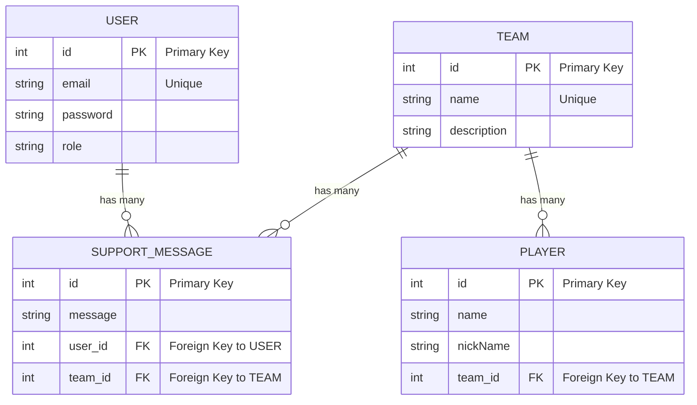

  

## Info

```mermaid
erDiagram
    USER {
        int id PK "Primary Key"
        string email "Unique"
        string password
        string role
    }
    TEAM {
        int id PK "Primary Key"
        string name "Unique"
        string description
    }
    SUPPORT_MESSAGE {
        int id PK "Primary Key"
        string message
        int user_id FK "Foreign Key to USER"
        int team_id FK "Foreign Key to TEAM"
    }
    PLAYER {
        int id PK "Primary Key"
        string name
        string nickName
        int team_id FK "Foreign Key to TEAM"
    }

    USER ||--o{ SUPPORT_MESSAGE : "has many"
    TEAM ||--o{ SUPPORT_MESSAGE : "has many"
    TEAM ||--o{ PLAYER : "has many"
```

## Getting started

